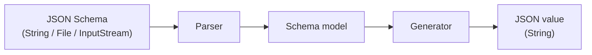
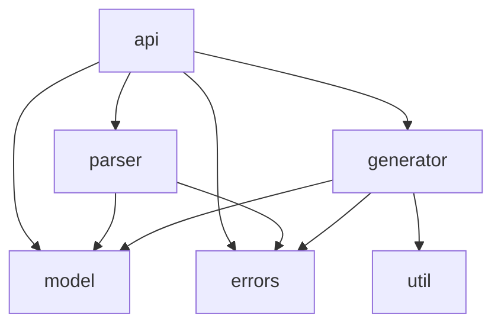

# Architecture

Gjuton turns a JSON Schema into valid JSON test data. Internally it is a
three-phase pipeline: a schema document is parsed into a model, and the model is
walked to produce a JSON value.

## Pipeline

1. **Parser** — deserializes a JSON Schema document into the internal schema
   model using Jackson data-binding. The parser is a thin wrapper around
   `ObjectMapper.readValue()`; the mapping itself is expressed as Jackson
   annotations on the model classes.
2. **Model** — Java classes representing schema constructs (type, constraints,
   `$ref`, combining keywords, and so on). Model classes carry the Jackson
   annotations that drive deserialization.
3. **Generator** — walks the model and produces a JSON value as a string.



The public API accepts a schema as a `String`, `File`, or `InputStream` and
returns a plain `String` — no third-party types are exposed. Convenience
overloads write the result to an `OutputStream`, `Writer`, or `File` instead.

## Schema model design

Cross-cutting JSON Schema keywords (`enum`, `const`, `if`/`then`/`else`, and the
combining keywords) are fields on the `Schema` base class rather than separate
schema types. Type-specific properties (for example `minimum` on integers) live
on the concrete subclasses. The generator checks the cross-cutting keywords
before dispatching on type.

## Generation strategy

The generator supports two strategies, selected by `GenerationMode`. The default
`RANDOM` mode emits random valid values. The opt-in `EXHAUSTIVE` mode prioritises
values that are likely to expose bugs in the system under test: for each type it
emits deterministic "trouble-prone" values first — an empty string for strings;
the minimum, maximum, and zero for integers — and then random valid values. This
trouble-prone-first ordering is what "boundary-value exhaustiveness" means in
issue acceptance criteria.

## Package layering

```
io.github.gjuton
├── api          public API — everything a consumer imports
├── errors       exception types (public, thrown from internal code)
└── internal     implementation detail, not part of the public contract
    ├── parser   JSON → schema model
    ├── model    schema model classes
    ├── generator model → JSON value string
    └── util     general-purpose utilities (math, random, string, functional)
```

Allowed dependencies between packages (enforced by ArchUnit — violations fail
`mvn test`):

```
api          — entry point; may access all layers
parser       — may only access model and errors
generator    — may only access model, errors, and util
model        — leaf; no dependencies on other internal packages
util         — leaf; no dependencies on other internal packages
errors       — leaf; no dependencies on other packages
```

Jackson (`com.fasterxml.jackson`) is allowed only in `parser` and `model`.
Consumers must only import from `api`, never from `internal` directly.

The `api`, `parser`, and `generator` packages and the leaf packages they build
on:



`model`, `util`, and `errors` are leaves — they have no outgoing dependencies on
other internal packages.
